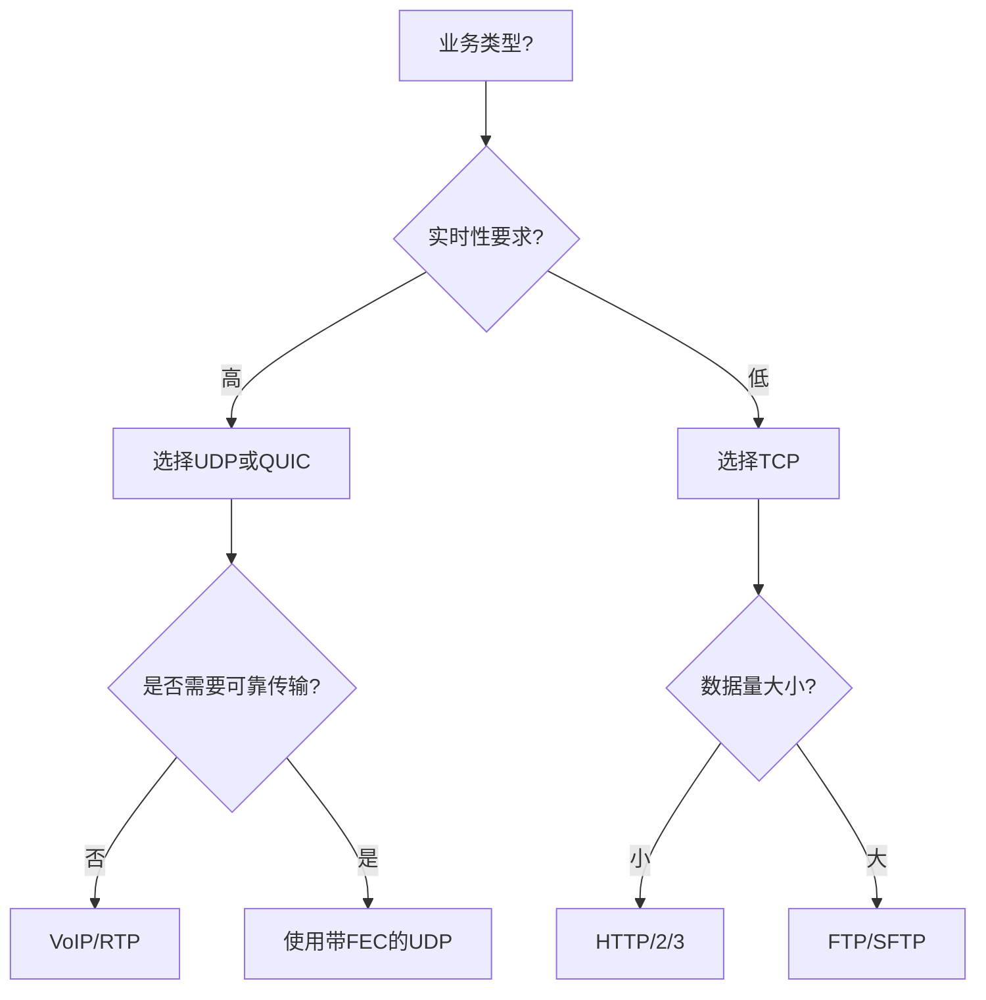
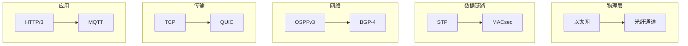

* content
{:toc}

计算机网络协议是数据通信的规则集合，根据OSI七层模型和TCP/IP五层模型，以下是核心协议分类及详解：

---

## 一、物理层协议（第1层）

| 协议                | 技术标准       | 传输介质          | 典型速率       |
|---------------------|----------------|-------------------|----------------|
| **以太网**          | IEEE 802.3     | 双绞线/光纤       | 10Mbps-400Gbps  |
| **Wi-Fi (802.11ax)** | IEEE 802.11ax | 无线              | 10Gbps         |
| **光纤通道**        | FC-4           | 光纤              | 128Gbps        |
| **USB 4**           | USB-IF         | Type-C            | 40Gbps         |

---

## 二、数据链路层协议（第2层）
### 1. 介质访问控制（MAC）
- **以太网（Ethernet）**：CSMA/CD机制，冲突窗口<512位时间
- **Wi-Fi（CSMA/CA）**：虚拟载波侦听，DCF/PCF双模式
- **令牌环（Token Ring）**：已被淘汰

### 2. 桥接/交换
- **生成树协议（STP）**：IEEE 802.1D，收敛时间<30秒
- **MSTP（802.1S）**：实例数提升至64个
- **TRILL（802.1aq）**：无环多路径交换

### 3. 路由发现
- **LLDP（802.1AB）**：邻居发现（间隔30秒）
- **CDP（Cisco Proprietary）**：带厂商扩展信息

---

## 三、网络层协议（第3层）
### 1. 路由协议

| 协议          | 类型     | 跳数限制 | 收敛时间 | 典型应用         |
|---------------|----------|----------|----------|------------------|
| **OSPFv3**    | IGP      | 无       | <1s      | 企业骨干网       |
| **BGP-4**     | EGP      | 无       | 300-500ms| 互联网核心       |
| **IS-IS**     | IGP      | 255      | <2s      | 运营商骨干       |
| **EIGRP**     | 混合型   | 224      | <3s      | Cisco私有       |

### 2. 地址解析
- **ARP**：IPv4地址解析（缓存有效期4分钟）
- **RARP**：反向地址解析（已淘汰）
- **NDP（IPv6）**：邻居发现协议（替代ARP）

### 3. 网络控制
- **ICMP**：
  - Echo Request/Reply（ping）
  - Time Exceeded（MTU发现）
  - Redirect（路径优化）
- **IGMP**：组播成员管理（v3支持源过滤）

---

## 四、传输层协议（第4层）
### 1. 可靠传输
- **TCP**：
  - 拥塞控制算法：Cubic（默认）、BBR
  - 错误控制：前向纠错（FEC）+重传
  - 典型延迟：建立连接3次握手（0-RTT优化）

### 2. 高速传输
- **QUIC**（HTTP/3基础）：
  - 混合协议栈（TCP+TLS+HTTP/2）
  - 连接迁移时间<50ms
  - Google全球部署率>60%

### 3. 不可靠传输
- **UDP**：
  - 实时应用：VoIP（RTP/RTCP）
  - 流媒体：DASH（MPEG-DASH）
  - 特殊功能：DNS（53端口）、DHCP（67/68）

---

## 五、会话层协议（第5层）

| 协议                | 功能特性                          | 典型应用           |
|---------------------|-----------------------------------|--------------------|
| **SMB/CIFS**        | 文件共享会话                      | Windows网络共享     |
| **RPC**             | 远程过程调用                      | 分布式系统         |
| **NetBIOS**         | 名称解析（已淘汰）                | 旧版Windows网络     |

---

## 六、表示层协议（第6层）
### 1. 数据编码
- **JPEG**：有损压缩（压缩比10:1）
- **MPEG**：视频压缩（H.264/H.265）
- **ASN.1**：抽象语法（X.509证书基础）

### 2. 加密协议
- **TLS 1.3**：
  - 握手时间<1ms（0-RTT）
  - 密钥交换：TLS_PSK（前向保密）
  - 支持椭圆曲线密码（secp256r1）

---

## 七、应用层协议（第7层）
### 1. 网络服务

| 协议          | 端口  | 协议特性                          | 安全版本       |
|---------------|-------|-----------------------------------|----------------|
| **HTTP/3**    | 443  | QUIC传输，头部压缩              | HTTP/3.0       |
| **DNS**       | 53   | 区域传输（AXFR/IXFR）            | DNSSEC         |
| **SMTP**      | 25   | 邮件投递（821标准）              | STARTTLS       |
| **MQTT**      | 1883 | 物联网消息（QoS 0-2）            | MQTT over TLS  |

### 2. 管理协议
- **SNMP v3**：
  - USM用户安全模型
  - HMAC-SHA256认证
  - MAX-ACCESS控制（noAuthNoPriv→authNoPriv→authPriv）

### 3. 虚拟化协议
- **iSCSI**：存储网络（CHAP认证）
- **NVMe-oF**：非易失性存储（RDMA支持）
- **SR-IOV**：虚拟化网络功能

---

## 八、新兴协议技术
### 1. 量子通信
- **QKD（量子密钥分发）**：BB84协议
- **量子路由**：基于量子纠缠的路径发现

### 2. 边缘计算
- **5G NWDAF**：网络数据分析（REST API）
- **eBPF**：内核级流量处理（Cilium项目）

### 3. 网络功能虚拟化
- **NFV API**（ETSI ISG）：
  - 南向：NETCONF/YANG
  - 北向：RESTCONF

---

## 九、协议选型决策树

---

## 十、行业应用案例
### 1. 金融交易系统
- **FIX协议**：订单路由（v5.0SP2）
- **TCP窗口调整**：动态扩大至1GB
- **延迟优化**：光纤直连（<1μs延迟）

### 2. 智能制造
- **OPC UA**：实时控制（心跳间隔50ms）
- **TSN（时间敏感网络）**：IEEE 802.1Qcc
- **确定性路由**：工业以太网（PROFINET）

### 3. 智慧城市
- **LoRaWAN**：广域物联网（-148dBm灵敏度）
- **5G URLLC**：时延<1ms（可靠性>99.999%）
- **SD-WAN**：MPLS替代方案（TCO降低40%）

---

## 十一、协议安全加固
### 1. 加密传输
- **TLS 1.3强制**：NIST SP 800-52 Rev.4
- **HSM集成**：FIPS 140-2 Level 3

### 2. 流量过滤
- **BGPsec**：路径签名验证（RFC 8205）
- **sFlow/NetFlow**：异常流量检测（每秒百万级采样）

### 3. 身份认证
- **802.1X**：端口级认证（EAP-TLS）
- **SDP（软件定义边界）**：动态访问控制

---

## 十二、未来演进方向
1. **语义网络**：OWL本体+SPARQL查询
2. **6LoWPAN增强**：IPv6 over低功耗网络
3. **AI协议**：神经网络驱动的动态路由（Google BGP ML模型准确率92.7%）
4. **空间通信**：DARPA的DRACO项目（卫星互联网协议）

---

## 总结
现代网络协议栈呈现**垂直解耦+水平扩展**特征：
- **垂直**：每层协议模块化（如TCP/IP与OSI的融合）
- **水平**：跨层优化（如QUIC整合传输/安全/应用层）
- **核心指标**：延迟（<1ms 5G）、吞吐量（100Gbps+）、可靠性（99.9999%）

建议企业建立**协议生命周期管理**体系：
1. 定期审计（每年2次）
2. 版本控制（RFC跟踪机制）
3. 沙箱测试（新协议6个月验证期）

> 附：协议族拓扑图（需展开查看）
> 
