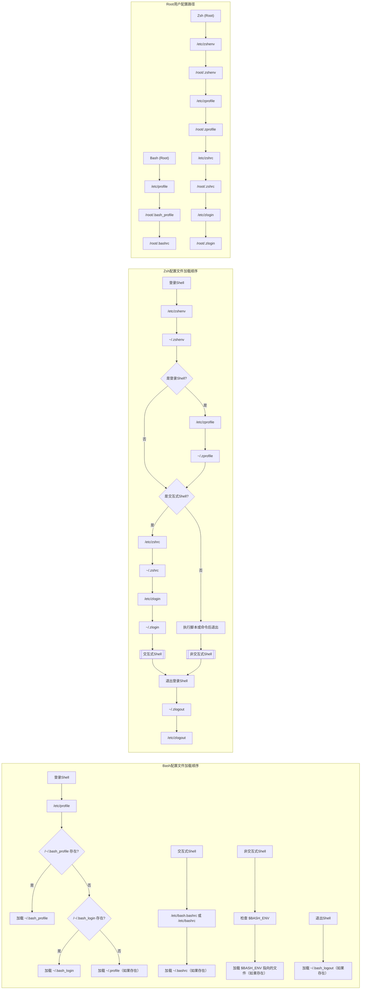

不同的$SHELL配置文件`*rc`加载顺序

```mermaid
flowchart LR
    subgraph "Bash配置文件加载顺序"
        B_LOGIN[登录Shell]
        B_INTERACTIVE[交互式Shell]
        B_NON_INTERACTIVE[非交互式Shell]

        B_LOGIN --> B_SYS_PROFILE["/etc/profile"]
        B_SYS_PROFILE --> B_USER_PROFILE{"/~/.bash_profile 存在?"}
        B_USER_PROFILE -->|是| B_LOAD_BASH_PROFILE[加载 ~/.bash_profile]
        B_USER_PROFILE -->|否| B_USER_LOGIN{"/~/.bash_login 存在?"}
        B_USER_LOGIN -->|是| B_LOAD_BASH_LOGIN[加载 ~/.bash_login]
        B_USER_LOGIN -->|否| B_LOAD_PROFILE["加载 ~/.profile（如果存在）"]

        B_INTERACTIVE --> B_SYS_BASHRC["/etc/bash.bashrc 或 /etc/bashrc"]
        B_SYS_BASHRC --> B_USER_BASHRC["加载 ~/.bashrc（如果存在）"]

        B_NON_INTERACTIVE --> B_ENV["检查 $BASH_ENV"]
        B_ENV --> B_LOAD_ENV["加载 $BASH_ENV 指向的文件（如果存在）"]

        B_LOGOUT["退出Shell"] --> B_LOAD_LOGOUT["加载 ~/.bash_logout（如果存在）"]
    end

    subgraph "Zsh配置文件加载顺序"
        Z_LOGIN[登录Shell]
        Z_INTERACTIVE[[交互式Shell]]
        Z_NON_INTERACTIVE[[非交互式Shell]]

        Z_LOGIN --> Z_ETC_ZSH["/etc/zshenv"]
        Z_ETC_ZSH --> Z_ZSHENV["~/.zshenv"]
        Z_ZSHENV --> Z_LOGIN_TEST{"是登录Shell?"}
        Z_LOGIN_TEST -->|是| Z_ETC_ZPROFILE["/etc/zprofile"]
        Z_ETC_ZPROFILE --> Z_ZPROFILE["~/.zprofile"]

        Z_LOGIN_TEST -->|否| Z_INTERACTIVE_TEST{"是交互式Shell?"}
        Z_ZPROFILE --> Z_INTERACTIVE_TEST
        
        Z_INTERACTIVE_TEST -->|是| Z_ETC_ZSHRC["/etc/zshrc"]
        Z_ETC_ZSHRC --> Z_ZSHRC["~/.zshrc"]
        Z_ZSHRC --> Z_ETC_ZLOGIN["/etc/zlogin"]
        Z_ETC_ZLOGIN --> Z_ZLOGIN["~/.zlogin"]
        Z_ZLOGIN --> Z_INTERACTIVE

        Z_INTERACTIVE_TEST -->|否| Z_SCRIPT["执行脚本或命令后退出"]
        Z_SCRIPT --> Z_NON_INTERACTIVE
        
        Z_INTERACTIVE --> Z_LOGOUT
        Z_NON_INTERACTIVE --> Z_LOGOUT

        Z_LOGOUT["退出登录Shell"] --> Z_ZLOGOUT["~/.zlogout"]
        Z_ZLOGOUT --> Z_ETC_ZLOGOUT["/etc/zlogout"]
    end

    subgraph "Root用户配置路径"
        ROOT_BASH["Bash (Root)"]
        ROOT_ZSH["Zsh (Root)"]

        ROOT_BASH --> ROOT_B_PROFILE["/etc/profile"]
        ROOT_B_PROFILE --> ROOT_B_USER_PROFILE["/root/.bash_profile"]
        ROOT_B_USER_PROFILE --> ROOT_B_BASHRC["/root/.bashrc"]

        ROOT_ZSH --> ROOT_Z_ZSHENV["/etc/zshenv"]
        ROOT_Z_ZSHENV --> ROOT_Z_USER_ZSHENV["/root/.zshenv"]
        ROOT_Z_USER_ZSHENV --> ROOT_Z_ZPROFILE["/etc/zprofile"]
        ROOT_Z_ZPROFILE --> ROOT_Z_USER_ZPROFILE["/root/.zprofile"]
        ROOT_Z_USER_ZPROFILE --> ROOT_Z_ZSHRC["/etc/zshrc"]
        ROOT_Z_ZSHRC --> ROOT_Z_USER_ZSHRC["/root/.zshrc"]
        ROOT_Z_USER_ZSHRC --> ROOT_Z_ZLOGIN["/etc/zlogin"]
        ROOT_Z_ZLOGIN --> ROOT_Z_USER_ZLOGIN["/root/.zlogin"]
    end
```